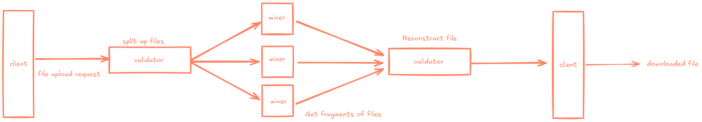
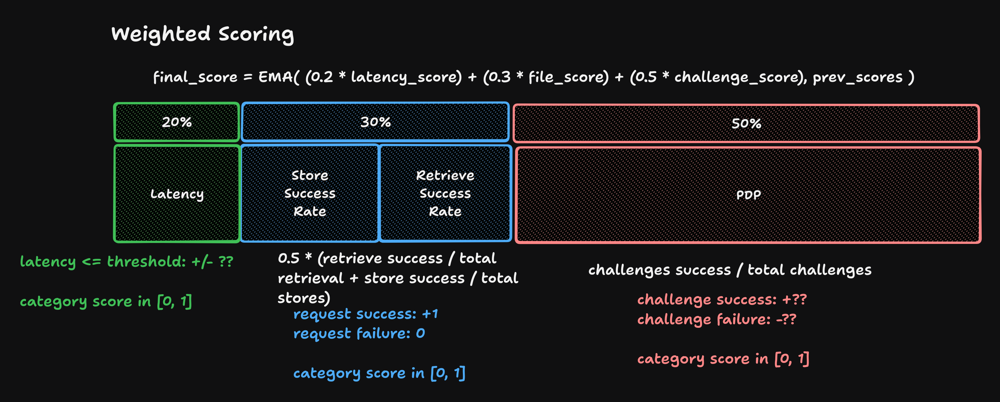
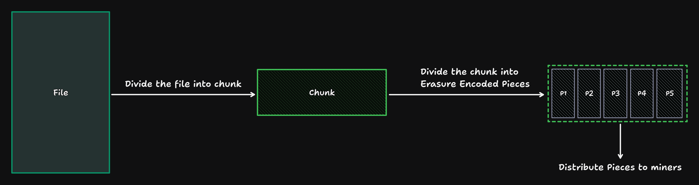
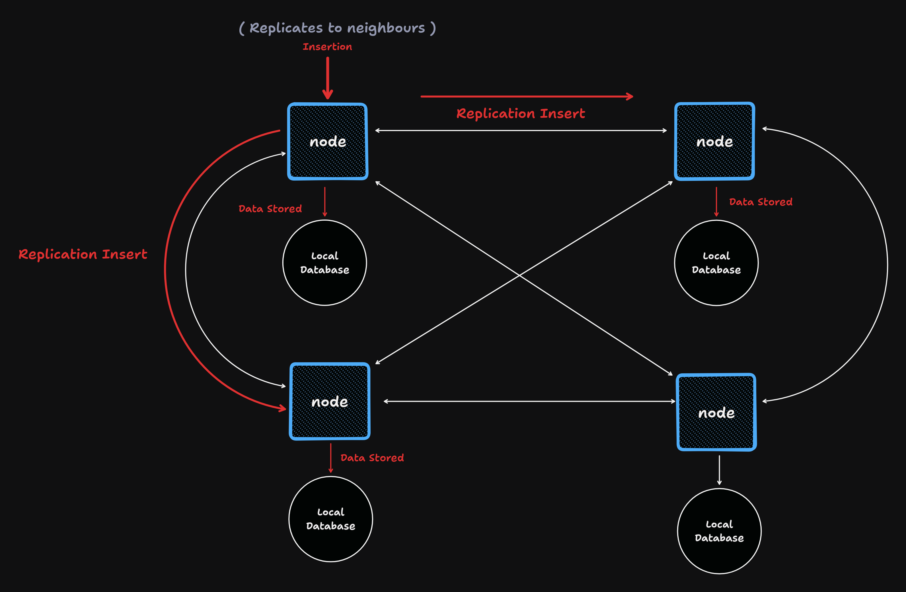

# Storb - An Overview

# TLDR

The subnet can be used as shown below:

Uploading files

- Client hits a validator endpoint to upload a file.
- The validator splits up the file into erasure-coded pieces that are then distributed to miners.
- The validator distributes the file metadata to other neurons through a DHT.

Retrieving files

- Client requests for a file through a validator.
- The validator uses the DHT to determine where the file pieces are stored then requests the pieces from the miners.
- The validator reconstructs the file with the pieces and sends it back to the client.

# Scoring Mechanism

Scoring is made up of multiple components:

- **Latency**: Miners are scored based on how quickly they respond to storage and retrieval requests.
- **Response Rate**: Reliable miners are the name of the game. The less a miner responds to storage and retrieval requests, the lower it is scored.
- **PDP Challenge**: The subnet uses an efficient proof of data possession (PDP) technique inspired by [Ateniese et al.](https://dl.acm.org/doi/10.1145/1315245.1315318) to ensure miners actually store the data they are asked to keep.

Please read [neurons/validator.py](../neurons/validator.py) for more information on how the scoring mechanism works.

# Chunking and Piecing

Files are split into erasure-coded chunks, and subsequently split into pieces and stored across various miners for redundancy.

# DHT for File Metadata

File metadata — which is useful for querying miners for pieces, and, eventually, reconstructing files — is replicated and stored across neurons in the subnet in the form of a DHT.

